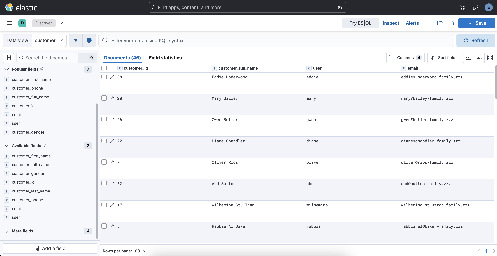

# Customer Data At Elasticsearch

This project is a Spring Boot application designed to interact with Elasticsearch. It includes functionality to extract and process customer data from Elasticsearch's `kibana_sample_data_ecommerce` index. And processed customer documents is indexed into the `customer` index.




## Prerequisites

- Java
- Maven
- Elasticsearch and kibana instances running and accessible
- `.env` file with the following variables:
  ```
  ELASTICSEARCH_USERNAME=<your-username>
  ELASTICSEARCH_PASSWORD=<your-password>
  ```

## Setup

1. Clone the repository:

   ```bash
   git clone https://github.com/berkesayin/customer-data-elasticsearch.git
   cd customer-data-elasticsearch
   ```

2. Create a `.env` file in the root directory and add your Elasticsearch credentials:

   ```bash
   ELASTICSEARCH_USERNAME=your-username
   ELASTICSEARCH_PASSWORD=your-password
   ```

3. Build the project:

   ```bash
   mvn clean install
   ```

4. Run the application:
   ```bash
   mvn spring-boot:run
   ```

## Configuration

The application is configured at the `application.yml` file:

```yaml
spring:
  application:
    name: customer-data

elasticsearch:
  username: ${ELASTICSEARCH_USERNAME}
  password: ${ELASTICSEARCH_PASSWORD}
```

## Usage

- Firstly, add `kibana_sample_data_ecommerce` index at kibana integrations
- Create `customer` index. For that, run this command at `kibana dev tools`
```json
PUT /customer
{
  "mappings": {
    "properties": {
      "customer_id": {
        "type": "keyword"
      },
      "customer_full_name": {
        "type": "text",
        "fields": {
          "keyword": {
            "type": "keyword",
            "ignore_above": 256
          }
        }
      },
      "customer_first_name": {
        "type": "text",
        "fields": {
          "keyword": {
            "type": "keyword",
            "ignore_above": 256
          }
        }
      },
      "customer_last_name": {
        "type": "text",
        "fields": {
          "keyword": {
            "type": "keyword",
            "ignore_above": 256
          }
        }
      },
      "customer_gender": {
        "type": "keyword"
      },
      "email": {
        "type": "keyword"
      },
      "customer_phone": {
        "type": "keyword"
      },
      "user": {
        "type": "keyword"
      }
    }
  }
}
``` 
- Then, add data view at Discover for customer index
- Run the application. It will extract and process customer data from  `kibana_sample_data_ecommerce` index
- Processed customer data will be indexed into the `customer` index in Elasticsearch
- So, customer documents will exist in `customer` index to be used as data
